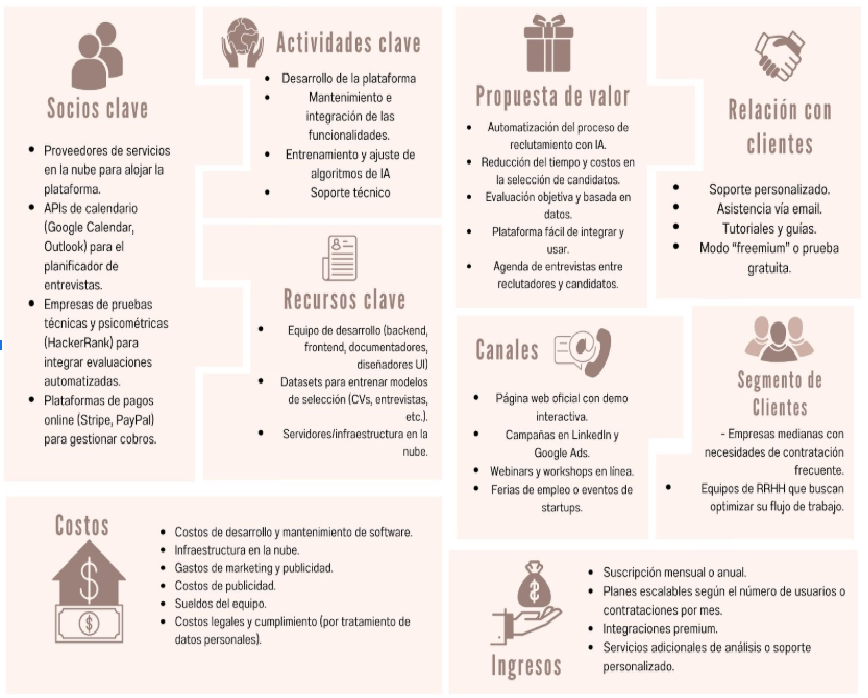

# Universidad Peruana De Ciencias Aplicadas

## Ingeniería de Software

### Informe de Trabajo Final

### Aplicaciones Web

**Sección:** 
4364

**Profesor:**  

Sánchez Ponce, Alex Humberto

**Integrantes:**

    <ul>
        <li>Peralta Chipa Ronald Joel - U202224619</li>
        <li>Bustamante Leveau Cameron Charlotte - U20231A804</li>
        <li>Lapa de la Cruz Gabriel Omar - U202216831</li>
        <li>Urrutia Peña Jasmin Adriana - U202310008</li>
        <li>otro companiero</li>
    </ul>

**2025 - 01**

---

# **Registro de Versiones del Informe**

| Versión | Fecha      | Autor                          | Descripción de modificación      |
|---------|------------|--------------------------------|----------------------------------|
| TB1     | 26/01/2025 | Ronald Joel Peralta Chipa      | (Descripción de los cambios)     |
| TB2     |            |                                |                                  |
| TB3     |            |                                |                                  |

# **Student Outcome:**

# **Contenido**

### Tabla de contenidos

- [**Registro de Versiones del Informe**](#registro-de-versiones-del-informe)
- [**Project Report Collaboration Insights**](#project-report-collaboration-insights)
- [**Contenido**](#contenido)
  - [Tabla de contenidos](#tabla-de-contenidos)
- [**Student Outcome**](#student-outcome)
- [ **Capítulo I: Introducción** ](#-capítulo-i-introducción-)
  - [**1.1. Startup Profile**](#11-startup-profile)
    - [**1.1.1. Descripción de la Startup**](#111-descripción-de-la-startup)
    - [**1.1.2. Perfiles de integrantes del equipo**](#112-perfiles-de-integrantes-del-equipo)
  - [**1.2. Solution Profile**](#12-solution-profile)
    - [**1.2.1 Antecedentes y problemática**](#121-antecedentes-y-problemática)
    - [**1.2.2 Lean UX Process**](#122-lean-ux-process)
    - [**1.2.2.1. Lean UX Problem Statements**](#1221-lean-ux-problem-statements)
    - [**1.2.2.2. Lean UX Assumptions**](#1222-lean-ux-assumptions)
    - [**1.2.2.3. Lean UX Hypothesis Statements**](#1223-lean-ux-hypothesis-statements)
    - [**1.2.2.4. Lean UX Canvas**](#1224-lean-ux-canvas)
  - [**1.3. Segmentos objetivo**](#13-segmentos-objetivo)
- [ **Capítulo II: Requirements Elicitation \& Analysis**](#-capítulo-ii-requirements-elicitation--analysis)
  - [**2.1. Competidores**](#21-competidores)
    - [**2.1.1. Análisis competitivo**](#211-análisis-competitivo)
    - [**2.1.2. Estrategias y tácticas frente a competidores**](#212-estrategias-y-tácticas-frente-a-competidores)
  - [**2.2. Entrevistas**](#22-entrevistas)
    - [**2.2.1. Diseño de entrevistas**](#221-diseño-de-entrevistas)
    - [**2.2.2. Registro de entrevistas**](#222-registro-de-entrevistas)
    - [**2.2.3. Análisis de entrevistas**](#223-análisis-de-entrevistas)
  - [**2.3. Needfinding**](#23-needfinding)
    - [**2.3.1. User Personas**](#231-user-personas)
    - [**2.3.2. User Task Matrix**](#232-user-task-matrix)
    - [**2.3.3. User Journey Mapping**](#233-user-journey-mapping)
    - [**2.3.4. Empathy Mapping**](#234-empathy-mapping)
    - [**2.3.5. As-is Scenario Mapping**](#235-as-is-scenario-mapping)
  - [**2.4. Ubiquitous Language**](#24-ubiquitous-language)
- [ **Capítulo III: Requirements Specification**](#-capítulo-iii-requirements-specification)
  - [**3.1. To-Be Scenario Mapping**](#31-to-be-scenario-mapping)
  - [**3.2. User Stories**](#32-user-stories)
  - [**3.3. Impact Mapping**](#33-impact-mapping)
  - [**3.4. Product Backlog**](#34-product-backlog)
- [**Capítulo IV: Product Design**](#capítulo-iv-product-design)
  - [**4.1. Style Guidelines**](#41-style-guidelines)
    - [**4.1.1. General Style Guidelines**](#411-general-style-guidelines)
    - [**4.1.2. Web Style Guidelines**](#412-web-style-guidelines)
  - [**4.2. Information Architecture**](#42-information-architecture)
    - [**4.2.1. Organization Systems**](#421-organization-systems)
    - [**4.2.2. Labeling Systems**](#422-labeling-systems)
    - [**4.2.3. SEO Tags and Meta Tags**](#423-seo-tags-and-meta-tags)
    - [**4.2.4. Searching Systems**](#424-searching-systems)
    - [**4.2.5. Navigation Systems**](#425-navigation-systems)
  - [**4.3. Landing Page UI Design**](#43-landing-page-ui-design)
    - [**4.3.1. Landing Page Wireframe**](#431-landing-page-wireframe)
    - [**4.3.2. Landing Page Mock-up**](#432-landing-page-mock-up)
  - [**4.4. Web Applications UX/UI Design**](#44-web-applications-uxui-design)
    - [**4.4.1. Web Applications Wireframes**](#441-web-applications-wireframes)
    - [**4.4.2. Web Applications Wireflow Diagrams**](#442-web-applications-wireflow-diagrams)
    - [**4.4.3. Web Applications Mock-ups**](#443-web-applications-mock-ups)
    - [**4.4.4. Web Applications User Flow Diagrams**](#444-web-applications-user-flow-diagrams)
  - [**4.5. Web Applications Prototyping**](#45-web-applications-prototyping)
  - [**4.6. Domain-Driven Software Architecture**](#46-domain-driven-software-architecture)
    - [**4.6.1. Software Architecture Context Diagram**](#461-software-architecture-context-diagram)
    - [**4.6.2. Software Architecture Container Diagrams**](#462-software-architecture-container-diagrams)
    - [**4.6.3. Software Architecture Components Diagrams**](#463-software-architecture-components-diagrams)
  - [**4.7. Software Object-Oriented Design**](#47-software-object-oriented-design)
    - [**4.7.1. Class Diagrams**](#471-class-diagrams)
    - [**4.7.2. Class Dictionary**](#472-class-dictionary)
  - [**4.8. Database Design**](#48-database-design)
    - [**4.8.1. Database Diagram**](#481-database-diagram)

# **Student Outcome**

#  **Capítulo I: Introducción** 

## **1.1. Startup Profile**
A continuación, se presenta una descripción de nuestra empresa **Jobsy**, así como la presentación del equipo de desarrollo responsable del software previamente mencionado, denominado **"Smarthire"**.

### **1.1.1. Descripción de la Startup**
En la actualidad, muchas áreas de Recursos Humanos enfrentan dificultades para mantener una atención de calidad hacia los postulantes a empleos. Se ha identificado un alto nivel de estrés laboral en estos equipos, causado principalmente por la sobrecarga de tareas repetitivas como la revisión manual de currículums, la publicación de vacantes en múltiples plataformas y la coordinación de entrevistas. Esta carga operativa no solo ralentiza los procesos de selección, sino que también afecta negativamente la experiencia del candidato y la eficiencia del equipo de RRHH.

Jobsy nace como una solución tecnológica innovadora que busca transformar este panorama. A través de nuestra plataforma "Smarthire", automatizamos las tareas más operativas del proceso de selección: desde la publicación inteligente de vacantes y el filtrado de CVs mediante inteligencia artificial, hasta la organización de entrevistas y evaluaciones técnicas o psicométricas. Además, ofrecemos integración con herramientas ampliamente utilizadas como LinkedIn, InfoJobs y CompuTrabajo, lo que permite una mayor difusión de las ofertas laborales con un solo clic.

Con Jobsy, aspiramos a optimizar el proceso de trabajo a los equipos de RRHH para que puedan enfocarse en lo que realmente importa: atraer, conocer y seleccionar al mejor talento humano, dejando en manos de la tecnología las tareas repetitivas y mecánicas.

Nuestra misión es brindar a las áreas de Recursos Humanos una plataforma inteligente que simplifique, agilice y optimice los procesos de selección de personal, mediante herramientas tecnológicas que permitan reducir la carga operativa y mejorar la experiencia tanto del reclutador como del postulante.

Nuestra visión es ser la solución líder en Latinoamérica en automatización del reclutamiento, reconocida por transformar la forma en que las empresas encuentran, seleccionan y gestionan talento, impulsando procesos más humanos, eficientes y estratégicos.

### **1.1.2. Perfiles de integrantes del equipo**
| Foto | Información |
|------|-------------|
|  | **Nombres y apellidos:** Ronald Joel Peralta Chipa **Código:** U202224619 **Carrera:** Ing. de Software **Descripción:** Soy una persona comprometida con el orden, con un estilo de liderazgo democrático y una gran capacidad para escuchar y comprender. Disfruto crecer en equipo y siempre estoy dispuesto a aprender de los demás. En mi faceta como desarrollador, tengo un especial interés en los lenguajes C# y JavaScript. |
|  | **Nombres y apellidos:** Cameron Charllotte Bustamante Leveau **Código:** U20231A804 **Carrera:** Ing. de Software **Descripción:** Me considero una persona creativa y versátil, con gusto por el trabajo en equipo y una fuerte motivación por aprender constantemente. Disfruto participar en proyectos diversos, enfrentar nuevos desafíos y buscar soluciones. Tengo conocimientos en C++, Python y otros lenguajes de programación, lo que me permite adaptarme con facilidad a distintos entornos tecnológicos. |
|  | **Nombres y apellidos:** Jasmin Adriana Urrutia Peña **Código:** U202310008 **Carrera:** Ing. de Software **Descripción:** Soy una persona responsable, creativa y empática, cualidades que me permiten establecer buenas conexiones con quienes me rodean. Valoro el trabajo en equipo porque me da la oportunidad de compartir ideas y aprender de otras perspectivas. Tengo conocimientos en lenguajes de programación como C + +, HTML, CSS , entre otros. Me gusta todo lo que es Frontend  y Diseño UX. |
|  | **Nombres y apellidos:** Ronald Joel Peralta Chipa **Código:** U202224619 **Carrera:** Ing. de Software **Descripción:** Soy una persona comprometida con el orden, con un estilo de liderazgo democrático y una gran capacidad para escuchar y comprender. Disfruto crecer en equipo y siempre estoy dispuesto a aprender de los demás. En mi faceta como desarrollador, tengo un especial interés en los lenguajes C# y JavaScript. |
|  | **Nombres y apellidos:** Lapa de la Cruz Gabriel Omar **Código:** U202216831 **Carrera:** Ing. de Software **Descripción:** Soy una persona responsable, comprometida y enfocada en seguir aprendiendo constantemente. Estoy mayormente acostumbrado al trabajo individual, pero mis responsabilidades pueden ayudar al grupo en lo que sea necesario. En mi faceta de formación y desarrollo, he adquirido conocimientos técnicos como el manejo intermedio de C++, JavaScript y Python, así como nociones básicas de SQL. |

## **1.2. Solution Profile**
En esta sección detallamos el funcionamiento y propuesta de valor de nuestro producto digital, resaltando tanto su factor innovador como su esquema de monetización.

#### Product Name.
El nombre de nuestra plataforma es “SmartHire". Se eligió este nombre por su enfoque claro en contrataciones inteligentes, eficientes y adaptadas a las necesidades del mercado moderno. La palabra "Smart" hace alusión a la inteligencia artificial y la automatización que optimizan todo el proceso de reclutamiento, mientras que "Hire" transmite de manera directa su propósito principal. Esta combinación genera confianza y comunica una propuesta clara: contrataciones más rápidas, precisas y efectivas.

#### Product Description.
Una vez publicada la oferta, la plataforma centraliza la recepción de postulaciones y aplica filtros inteligentes que clasifican automáticamente los CVs en categorías como "aptos", "en duda" y "descartados", según criterios personalizados. Desde un panel interactivo, los reclutadores pueden refinar los resultados, aplicar filtros avanzados, enviar pruebas técnicas automatizadas y agendar entrevistas directamente desde la plataforma. Además, SmartHire permite generar contratos laborales digitales y gestionar el onboarding del nuevo colaborador, incluyendo accesos, checklist de incorporación y recursos de bienvenida. Finalmente, se dispone de un dashboard con métricas de rendimiento, como tiempo promedio de contratación o eficiencia del embudo, que permiten mejorar procesos futuros con base en datos reales.

#### Monetization.
SmartHire adoptará un modelo de negocio tipo Software as a Service (SaaS), dirigido a empresas y organizaciones que deseen mejorar sus procesos de reclutamiento. Las compañías pagarán una suscripción mensual o anual para acceder a todas las funcionalidades de la plataforma, incluyendo la publicación automática de vacantes, el filtrado inteligente de CVs con IA, la programación de entrevistas, y el seguimiento completo del proceso de selección.

### **1.2.1. Antecedentes y problemática**
Descripción de la problemática.
En el contexto actual, los procesos de reclutamiento y selección en muchas empresas siguen siendo largos, ineficientes y, en varios casos, propensos a errores humanos o sesgos. Las áreas de Recursos Humanos deben revisar manualmente cientos de currículums, coordinar entrevistas por distintos canales y hacer seguimiento de manera dispersa, lo cual genera demoras, sobrecarga operativa y una experiencia poco fluida tanto para el candidato como para la empresa.

A pesar de que existen soluciones tecnológicas que buscan optimizar estos procesos, muchas de ellas no se adaptan completamente a la realidad local o presentan costos elevados. Además, gran parte de estas plataformas están diseñadas para grandes corporaciones, dejando de lado a medianas y pequeñas empresas que también necesitan contratar talento de manera ágil y eficiente.

En ese contexto, surge la necesidad de una herramienta centralizada, intuitiva y automatizada que facilite el proceso de contratación, desde la publicación de vacantes hasta la incorporación del candidato. Una solución que ahorre tiempo, reduzca sesgos y permita a los equipos de RRHH tomar decisiones basadas en datos. SmartHire nace para atender esta problemática con un enfoque moderno, accesible y adaptable a distintos tamaños de empresa.

La metodología 5W y 2H es una herramienta práctica y eficaz para solucionar problemas relacionados a la gestión y análisis de datos. Este enfoque nos permite responder siete preguntas fundamentales que permiten abordar cualquier situación de manera estructurada. 

### **What (¿Qué?)**
Las empresas enfrentan procesos de selección lentos, poco eficientes y con alta carga operativa, lo que genera pérdida de tiempo, errores humanos y una experiencia insatisfactoria tanto para los reclutadores como para los candidatos.

### **Who (¿Quién?)**
A reclutadores, responsables de selección de personal, y en general a los equipos de Recursos Humanos que deben gestionar múltiples procesos de contratación con recursos limitados. También afecta a los postulantes, que no siempre reciben una experiencia clara ni oportuna.
### **Where (¿Dónde?)**
En los departamentos de Recursos Humanos de empresas de distintos tamaños, especialmente en aquellas que aún no cuentan con herramientas tecnológicas integradas o que usan soluciones dispersas y poco automatizadas.

### **When (¿Cuándo?)**
Durante todo el proceso de contratación, desde la creación y publicación de vacantes, hasta la recepción, filtrado de CVs, entrevistas y selección final. El problema se intensifica cuando hay muchas postulaciones o vacantes urgentes.

### **Why (¿Por qué?)**
La falta de automatización y digitalización en los procesos de reclutamiento. Muchas tareas se hacen manualmente, lo que consume tiempo, aumenta el margen de error y dificulta la organización y el seguimiento de candidatos.

### **How (¿Cómo?)**
Ocurre cuando los reclutadores deben buscar candidatos entre cientos de CVs, usar múltiples herramientas para comunicarse y evaluar, y realizar seguimiento manual de cada etapa. Todo esto provoca demoras, decisiones poco informadas y frustración en el equipo.

### **How much (¿Cuánto?)**
De acuerdo con el portal El HuffPost (2025). La digitalización se ha convertido en un pilar esencial en la gestión del talento, permitiendo a las empresas automatizar procesos críticos como la administración de nóminas y la gestión documental. Esto no solo facilita la toma de decisiones informadas y mejora la eficiencia en los departamentos de Recursos Humanos, sino que también optimiza la experiencia del empleado al proporcionar acceso rápido y seguro a su información personal y profesional. Además, la implementación de herramientas digitales reduce la carga de trabajo manual, minimiza errores y libera tiempo para que el personal de RRHH se enfoque en actividades estratégicas como el desarrollo del talento y la planificación organizacional. En el contexto de SmartHire, estas ventajas se potencian al ofrecer una plataforma integral que centraliza y automatiza todo el proceso de reclutamiento y selección, desde la publicación de vacantes hasta la incorporación de nuevos empleados, mejorando significativamente la eficiencia y efectividad del área de Recursos Humanos.

### **1.2.2. Lean UX Process**
Lean UX es una metodología ágil que pone énfasis en la colaboración constante y el aprendizaje iterativo durante el desarrollo de un producto, priorizando la acción sobre la documentación exhaustiva. Este enfoque impulsa el trabajo conjunto entre los equipos de diseño y desarrollo, quienes crean prototipos y obtienen retroalimentación valiosa mediante ciclos de mejora continua.

Su objetivo esencial es validar hipótesis de forma ágil y con el menor uso de recursos, garantizando así que el resultado final sea adaptable y responda verdaderamente a las necesidades de los usuarios (Gothelf, 2013).

#### **1.2.2.1. Lean UX Problem Statements**
Nuestra Startup fue diseñada para optimizar y modernizar los procesos de selección de personal, brindando a las empresas una plataforma centralizada, automatizada e intuitiva que permite realizar contrataciones más rápidas, precisas y efectivas.

Hemos observado que el proceso de reclutamiento no está cumpliendo con estos objetivos en muchas empresas, ya que los equipos de Recursos Humanos enfrentan dificultades al gestionar manualmente grandes volúmenes de postulaciones, coordinar entrevistas en múltiples canales y tomar decisiones sin datos claros o centralizados.

Esto está causando retrasos en las contrataciones, errores humanos y una experiencia poco satisfactoria tanto para los candidatos como para los reclutadores, lo cual impacta negativamente en la eficiencia operativa y en la capacidad de atraer talento de calidad.

¿Cómo podemos mejorar la eficiencia operativa y la calidad de las contrataciones, proporcionando una plataforma web que automatice el filtrado de CVs, centralice todas las etapas del proceso y ofrezca métricas útiles para una toma de decisiones estratégicas basada en datos objetivos?

#### **1.2.2.2. Lean UX Assumptions**
#### Business Outcomes:
Nuestra plataforma está diseñada para automatizar las tareas críticas del área de Recursos Humanos, mejorando su productividad y reduciendo los costos operativos asociados a los métodos tradicionales. Al ofrecer una solución moderna, accesible y basada en datos, aspiramos a posicionarnos como una herramienta esencial para empresas grandes, medianas y pequeñas que buscan profesionalizar su gestión de talento.

Suponemos que al ofrecer SmartHire como una solución innovadora, confiable y enfocada en optimizar el proceso de contratación, lograremos ventas directas a empresas medianas interesadas en planes mensuales o anuales. Esto nos permitirá generar ingresos sostenibles, alcanzar una rentabilidad y recuperar la inversión inicial dentro del primer año tras el despliegue de la aplicación.

#### User Outcomes:
Cuando los equipos de Recursos Humanos utilicen SmartHire, experimentaran una mejora significativa en la eficiencia de sus procesos de reclutamiento. Al centralizar herramientas clave como el filtrado automático de CVs y la programación de entrevistas, podrán ahorrar tiempo, tomar decisiones más informadas y reducir la carga operativa. Esto les permitirá enfocarse en tareas más estratégicas, mejorar la experiencia del candidato y aumentar la calidad general de las contrataciones, sintiéndose más satisfechos con su trabajo y sus resultados.

**Features y Assumptions:**

1. **Filtrado inteligente de CVs con IA**:  
   Suponemos que los reclutadores confían en algoritmos para preseleccionar candidatos de forma precisa, según el cumplimiento de aptitudes registradas para el puesto.

2. **Panel interactivo de gestión de postulaciones**:  
   El usuario desea tener control visual y rápido del estado de cada postulación.

3. **Envío automatizado de pruebas técnicas**:  
   Suponemos que los usuarios prefieren automatizar esta etapa para reducir la carga operativa y garantizar una evaluación estandarizada de los postulantes.

4. **Agendamiento de entrevistas desde la plataforma**:  
   Suponemos que los reclutadores valoran poder coordinar entrevistas desde un solo lugar, sin depender de herramientas externas.

5. **Generación de contratos digitales y gestión del onboarding**:  
   Suponemos que las empresas desean digitalizar completamente el proceso de incorporación para hacerlo más ágil y ordenado.

6. **Publicación automatizada de vacantes**:  
   Suponemos que los usuarios valoran poder publicar vacantes de manera rápida y urgencia.

7. **Sistema de seguimiento de candidatos**:  
   Suponemos que los reclutadores necesitan una línea de tiempo clara del proceso de cada candidato para evitar confusiones.

8. **Cantificación para evaluar habilidades blandas**:  
   Suponemos que los reclutadores estarán abiertos a utilizar dinámicas interactivas para detectar rasgos como liderazgo, comunicación o trabajo en equipo de manera más natural y divertida.

9. **Organizador de evaluación y entrevistas programadas**:  
   Suponemos que los usuarios valorarán tener una agenda donde puedan gestionar fechas y recordatorios de todos los candidatos en un solo lugar.

#### **1.2.2.3. Lean UX Hypothesis Statements**
1. **Hipótesis 1:**  
   **Creemos que** los reclutadores preferirán el filtrado inteligente por IA frente a la revisión manual de CVs.  
   **Sabremos que esta hipótesis es cierta**  
   **Cuando veamos que** al menos el 70% de los usuarios usa el filtrado automático.

2. **Hipótesis 2:**  
   **Creemos que** la publicación automatizada de vacantes facilitará una mayor difusión de las ofertas laborales y reducirá el tiempo de publicación. 
   **Sabremos que esta hipótesis es cierta**  
   **Cuando veamos** una reducción del 50% en el tiempo promedio que toma publicar las vacantes en otros portales.

3. **Hipótesis 3:**  
   **Creemos que** el sistema de seguimiento de candidatos permitirá una gestión más ordenada y eficiente del proceso de selección.  
   **Sabremos que esta hipótesis es cierta**  
   **Cuando** los usuarios consulten y actualicen el estado de los candidatos frecuentemente dentro del sistema.

4. **Hipótesis 4:**  
   **Creemos que** la gamificación para evaluar habilidades blandas mejorará el nivel de engagement de los postulantes y facilitará la evaluación de competencias sociales. 
   **Sabremos que esta hipótesis es cierta**  
   **Cuando** más del 50% de los candidatos completen las pruebas gamificadas y los reclutadores tomen en cuenta esto en su decisión final.

5. **Hipótesis 5:**  
   **Creemos que** los usuarios valorarán tener una agenda donde puedan gestionar fechas y recordatorios de todos los candidatos en un solo lugar.  
   **Sabremos que esta hipótesis es cierta**  
   **Cuando veamos que** al menos el 75% de los usuarios utilizan activamente la agenda para programar entrevistas y establecer recordatorios durante el proceso de evaluación.

#### **1.2.2.4. Lean UX Canvas**

## **1.3. Segmentos objetivo**
### Segmento 1: Equipos de Recursos Humanos encargados del proceso de contratación
La segmentación del tipo de usuario de nuestra startup está conformada por empresas que buscan optimizar sus procesos de selección a través de herramientas tecnológicas intuitivas y eficientes. Principalmente, nos dirigimos a:

- Empresas medianas (entre 50 y 250 empleados) que no cuentan con soluciones completas de automatización.
- Equipos de Recursos Humanos conformados por 1 a 5 personas, que gestionan múltiples vacantes al mes.
- Profesionales con entre 25 y 45 años de edad, con experiencia en selección de personal, reclutamiento y gestión de talento.
- Sectores como tecnología, servicios, comercio y educación, donde la rotación de personal suele ser más alta.
- Ubicadas en contextos urbanos, con cierta familiaridad con herramientas digitales, pero que aún utilizan procesos manuales o poco integrados.

### Segmento 2: Postulantes (Candidatos para el empleo)
La segmentación del tipo de usuario postulante incluye a personas activas en el mercado laboral que buscan oportunidades de empleo acordes a su perfil profesional. Este grupo está conformado por:

- Jóvenes profesionales y técnicos entre 22 y 35 años, egresados de universidades o institutos técnicos.
- Personas con experiencia laboral previa de entre 1 y 5 años, principalmente en áreas como tecnología, diseño, administración, ventas o atención al cliente.
- PResidentes de zonas urbanas con acceso a internet y familiarizados con el uso de plataformas digitales para postularse (como LinkedIn, Computrabajo, etc.).
- Personas que valoran una experiencia de postulación clara, ágil y moderna, con comunicación rápida y procesos más transparentes.
- Interesados en empresas que tengan procesos actualizados, con posibilidad de seguimiento de su postulación, evaluaciones claras y entrevistas organizadas.

#  **Capítulo II: Requirements Elicitation & Analysis**
## **2.1. Competidores**

A continuación presentamos a nuestros tres principales competidores indirectos:

- **LinkedIn:** es una red social profesional global que combina oportunidades de empleo con funciones de networking, publicaciones y aprendizaje en línea. Si bien permite aplicar a empleos y conectar con reclutadores, su enfoque está más centrado en la visibilidad profesional y no en procesos de selección personalizados o automatizados.

- **Computrabajo:** es una plataforma de búsqueda de empleo muy popular en países de habla hispana. Ofrece publicación de vacantes y filtros por criterios básicos, pero su sistema está enfocado en la gestión tradicional de CVs, sin incluir herramientas modernas como análisis predictivos o evaluaciones interactivas.

- **HireVue:** es una solución empresarial que utiliza inteligencia artificial para realizar entrevistas por video y evaluaciones automatizadas. Su tecnología está orientada a grandes organizaciones y procesos estructurados, pero con una curva de uso más compleja para medianas empresas o postulantes menos familiarizados con herramientas digitales avanzadas.

### **2.1.1. Análisis competitivo**

<TABLE BORDER style="width:100%">
    <tr>
        <th colspan="6">Competitive Analysis Landscape</th>
    </tr>
    <tr>
        <td rowspan="2">
            ¿Por qué llevar a cabo este análisis?
        </td>
        <td colspan="5"> 
        Porque nos permite identificar oportunidades de mejora e innovación frente a soluciones ya conocidas, mejorando nuestra propuesta de valor y diferenciación en el mercado de RRHH.
        </td>
    </tr>
    <tr>
        <td colspan="5">¿Qué aporte de valor podría ofrecer nuestro producto en contraste al resto de competidores?</td>
    </tr>
    <tr>
        <td colspan="2">
            (En la cabecera colocar por cada competidor nombre y logo)
        </td>
        <td>Jobsy</td>
        <td>LinkedIn</td>
        <td>Computrabajo</td>
        <td>HireVue</td>
    </tr>
    <tr>
        <th rowspan="2">Perfil</th>
        <td>Overview</td>
        <td>Plataforma de contratación inteligente que automatiza publicaciones, filtra CVs con IA, y gestiona entrevistas y evaluaciones técnicas.</td>
        <td>Red social profesional que permite publicar empleos, hacer networking y contactar talentos mediante su plataforma.</td>
        <td>Portal web de empleos popular en Latinoamérica, enfocado en la publicación de vacantes y la gestión de postulaciones.</td>
        <td>Plataforma especializada en entrevistas por video y evaluaciones con IA para el reclutamiento empresarial.</td>
    </tr>
    <tr>
        <td>Ventaja competitiva</td>
        <td>Automatización completa, IA para filtrado de CVs, gamificación de habilidades blandas y sistema de referidos.</td>
        <td>Gran red de profesionales, sistema de recomendaciones y validación social de perfiles.</td>
        <td>Alto tráfico en LATAM, facilidad de uso para empresas pequeñas y medianas.</td>
        <td>Evaluación profunda a través de entrevistas estructuradas y algoritmos de IA.</td>
    </tr>
    <tr>
        <th rowspan="2">Perfil de Marketing</th>
        <td>Mercado objetivo</td>
        <td>Empresas medianas y grandes que buscan optimizar procesos de selección. Postulantes que buscan sugerencias inteligentes.</td>
        <td>Profesionales de todas las industrias. Empresas que quieren visibilidad en una red global.</td>
        <td>Empresas en LATAM, especialmente en sectores administrativos, operativos y comerciales.</td>
        <td>Corporaciones que buscan evaluar de forma precisa y digital las habilidades de sus candidatos.</td>
    </tr>
    <tr>
        <td>Estrategias de marketing</td>
        <td>Campañas en LinkedIn y Google Ads, webinars de RRHH, casos de éxito en redes y SEO enfocado en empresas.</td>
        <td>Publicidad integrada en la red, recomendaciones automatizadas y contenido profesional en blog y newsletter.</td>
        <td>Email marketing, presencia en redes sociales y posicionamiento SEO por sectores laborales.</td>
        <td>Marketing B2B en ferias tecnológicas, campañas institucionales y whitepapers.</td>
    </tr>
    <tr>
        <th rowspan="3">Perfil de Producto</th>
        <td>Productos & Servicios</td>
        <td>Publicación automatizada, IA para CVs, entrevistas integradas, gamificación, referidos, y sistema de seguimiento.</td>
        <td>Publicación de empleos, red de contactos, mensajes directos, y validación de experiencia.</td>
        <td>Publicación de empleos, base de datos de candidatos, alertas y filtros de búsqueda.</td>
        <td>Entrevistas por video, análisis emocional, pruebas técnicas, dashboards para RRHH.</td>
    </tr>
    <tr>
        <td>Precios & Costos</td>
        <td>Para usar el servicio, la empresa compra un plan que puede ser mensual o anual.</td>
        <td>Publicación gratuita limitada, opciones de pago según alcance y número de vacantes.</td>
        <td>Planes desde gratuitos hasta paquetes premium por número de vacantes o visibilidad.</td>
        <td>Modelo SaaS por suscripción anual. Planes personalizados para empresas.</td>
    </tr>
    <tr>
        <td>Canales de distribución</td>
        <td>Web y app móvil (iOS y Android).</td>
        <td>Web, app móvil y navegador de escritorio.</td>
        <td>Principalmente web. Tiene versión responsive para móviles.</td>
        <td>Web corporativa y dashboards para empresas.</td>
    </tr>
    <tr>
        <th rowspan="5">Análisis SWOT</th>
        <td colspan="5">Se analiza fortalezas, debilidades, oportunidades y amenazas para entender el posicionamiento estratégico.</td>
    </tr>
    <tr>
        <td>Fortalezas</td>
        <td>Automatización total, análisis con IA, experiencia gamificada para postulantes, integración multiplataforma.</td>
        <td>Gran base de usuarios activos, reputación internacional, funcionalidades sociales profesionales.</td>
        <td>Reconocimiento en LATAM, interfaz sencilla y bajo costo.</td>
        <td>Análisis avanzado, entrevistas estructuradas y uso efectivo de IA.</td>
    </tr>
    <tr>
        <td>Debilidades</td>
        <td>Plataforma nueva en validación de mercado, aún sin posicionamiento fuerte.</td>
        <td>Poca personalización en procesos de selección internos, saturación de contenido.</td>
        <td>Falta de innovación en IA o seguimiento de procesos.</td>
        <td>No incluye publicación de ofertas ni red social, solo entrevistas.</td>
    </tr>
    <tr>
        <td>Oportunidades</td>
        <td>Aliarse con universidades y atraer empresas tecnológicas en crecimiento.</td>
        <td>Monetización de nuevas herramientas premium para empresas.</td>
        <td>Expansión a mercados de habla portuguesa, mejoras con IA.</td>
        <td>Incorporar más idiomas, ampliar herramientas de evaluación gamificada.</td>
    </tr>
    <tr>
        <td>Amenazas</td>
        <td>Competidores consolidados, cambios en políticas de privacidad o laborales.</td>
        <td>Apps más ágiles o disruptivas en el sector laboral.</td>
        <td>Desplazamiento por plataformas más tecnológicas o globales.</td>
        <td>Falta de diferenciación en IA frente a nuevos competidores.</td>
    </tr>
</TABLE>

### **2.1.2. Estrategias y tácticas frente a competidores**

En base al análisis competitivo realizado previamente sobre las plataformas de búsqueda de empleo y conexión laboral, identificamos las principales **fortalezas, debilidades, oportunidades y amenazas** de nuestros competidores. A partir de ello, Jobsy plantea estrategias claras y tácticas aplicables para diferenciarse y destacar en el mercado.

---

* **Afrontando las Fortalezas de los Competidores**

**Fortalezas de la competencia:**
- Amplia base de usuarios y empresas registradas.
- Integración con redes profesionales (como LinkedIn).
- Algoritmos avanzados para recomendación de empleos.

**Fortalezas de Jobsy:**
- Sistema de compatibilidad inteligente entre candidatos y empresas, enfocado en valores y cultura laboral.
- Procesos de aplicación más rápidos y simplificados.
- Comunicación directa entre candidato y reclutador mediante la plataforma.

**Estrategia:**
Ofrecer una experiencia de búsqueda laboral centrada en la compatibilidad cultural y profesional entre usuario y empresa, con procesos ágiles y acompañamiento personalizado.

**Tácticas:**
- Implementar una herramienta de "match cultural" entre empresas y postulantes.
- Permitir feedback directo post-entrevista para mejorar procesos.
- Promover perfiles de empresas con enfoque humano y responsable.

---

* **Aprovechando las Debilidades de los Competidores**

**Debilidades de la competencia:**
- Procesos de aplicación extensos y poco amigables.
- Falta de personalización en las recomendaciones de empleo.
- Escasa retroalimentación a los postulantes.

**Estrategia:**
Optimizar el proceso de búsqueda y postulación con herramientas intuitivas, automatizadas y enfocadas en el usuario.

**Tácticas:**
- Currículum inteligente que se adapta a cada postulación.
- Recomendaciones personalizadas de empleo según habilidades blandas y técnicas.
- Seguimiento automático del estado de postulación.

---

* **Aprovechando las Oportunidades del Mercado**

**Oportunidades actuales:**
- Crecimiento del empleo remoto e híbrido.
- Aumento de personas en búsqueda de su primer empleo o de un cambio laboral con propósito.
- Demanda de plataformas más humanas y transparentes.

**Oportunidades de Jobsy:**
- Posicionar a Jobsy como un puente entre empresas con valores y talentos que buscan propósito.
- Ampliar la oferta de empleos remotos e internacionales.

**Estrategia:**
Convertirse en la plataforma de referencia para empleos que se alineen con valores personales y bienestar laboral.

**Tácticas:**
- Categorías destacadas: empleo remoto, primer empleo, reconversión laboral.
- Test vocacional y de valores para mejorar la recomendación de vacantes.
- Publicidad en redes sociales destacando testimonios reales de éxito.

---

* **Enfrentando las Amenazas del Mercado**

**Amenazas actuales:**
- Plataformas establecidas con fuerte presencia (como Indeed, Computrabajo).
- Aplicaciones móviles muy posicionadas y con alta inversión en publicidad.
- Integraciones con inteligencia artificial generativa en procesos de selección.

**Estrategia:**
Aprovechar la agilidad y el enfoque innovador de Jobsy para adaptarse rápidamente, enfocándose en nichos específicos y experiencias diferenciadas.

**Tácticas:**
- Actualizaciones constantes basadas en feedback del usuario.
- Ofrecer herramientas simples y efectivas para empresas en crecimiento o startups.
- Integración con IA para mejorar el perfilamiento de candidatos y análisis de vacantes.

## **2.2. Entrevistas**
### **2.2.1. Diseño de entrevistas**

#### Entrevista General
  1. ¿Cuál es tu nombre, edad y ocupación actual?
  2. ¿Qué dispositivos usas más para trabajar o buscar empleo?
  3. ¿Qué redes sociales o plataformas usas con frecuencia para temas laborales?

#### Segmento 1: Empresas
  1. ¿Con qué frecuencia publican vacantes y qué pasos siguen para hacerlo?
  2. ¿Qué tan útil sería para ti una herramienta que permita publicar automáticamente en varias plataformas?
  3. ¿Cómo gestionan actualmente la recepción y filtrado de CVs, y qué tan efectivo consideras ese proceso?
  4. ¿Han evaluado el uso de inteligencia artificial para mejorar ese filtrado?
  5. ¿Qué criterios específicos te gustaría poder configurar en un sistema para automatizar la selección inicial de candidatos?
  6. ¿Cómo organizan actualmente entrevistas y evaluaciones técnicas o psicométricas?
  7. ¿Usan herramientas digitales para ese proceso o todo se maneja manualmente?
  8. ¿Qué tan importante te parece contar con una plataforma que centralice todo el proceso de contratación?

#### Segmento 2: Postulantes
  1. ¿Qué tipo de empleo estás buscando actualmente y en qué sector?
  2. ¿Qué plataformas o medios digitales utilizas con más frecuencia para encontrar oportunidades laborales?
  3. ¿Has usado alguna vez sistemas que te recomienden trabajos basándose en tu CV? ¿Te resultaron útiles?
  4. ¿Qué parte del proceso de postulación te parece más complicada o frustrante?
  5. ¿Qué tan útil sería para ti recibir sugerencias para mejorar tu CV directamente desde la plataforma?
  6. ¿Qué tan cómodo te sientes realizando entrevistas o evaluaciones técnicas de manera online?
  7. ¿Por qué medio prefieres que te contacten después de postular (correo electrónico, WhatsApp, llamada)?
  8. ¿Te gustaría tener una sección de seguimiento para ver el estado de tus postulaciones dentro de la misma plataforma?

### **2.2.2. Registro de entrevistas**
### **2.2.3. Análisis de entrevistas**

## **2.3. Needfinding**
### **2.3.1. User Personas**
### **2.3.2. User Task Matrix**
### **2.3.3. User Journey Mapping**
### **2.3.4. Empathy Mapping**
### **2.3.5. As-is Scenario Mapping**

## **2.4. Ubiquitous Language**

#  **Capítulo III: Requirements Specification**

## **3.1. To-Be Scenario Mapping**
## **3.2. User Stories**
## **3.3. Impact Mapping**
## **3.4. Product Backlog**

# **Capítulo IV: Product Design**

## **4.1. Style Guidelines**
### **4.1.1. General Style Guidelines**
### **4.1.2. Web Style Guidelines**

## **4.2. Information Architecture**
### **4.2.1. Organization Systems**
### **4.2.2. Labeling Systems**
### **4.2.3. SEO Tags and Meta Tags**
### **4.2.4. Searching Systems**
### **4.2.5. Navigation Systems**

## **4.3. Landing Page UI Design**
### **4.3.1. Landing Page Wireframe**
### **4.3.2. Landing Page Mock-up**

## **4.4. Web Applications UX/UI Design**
### **4.4.1. Web Applications Wireframes**
### **4.4.2. Web Applications Wireflow Diagrams**
### **4.4.3. Web Applications Mock-ups**
### **4.4.4. Web Applications User Flow Diagrams**

## **4.5. Web Applications Prototyping**

## **4.6. Domain-Driven Software Architecture**
### **4.6.1. Software Architecture Context Diagram**
### **4.6.2. Software Architecture Container Diagrams**
### **4.6.3. Software Architecture Components Diagrams**

## **4.7. Software Object-Oriented Design**
### **4.7.1. Class Diagrams**
### **4.7.2. Class Dictionary**

## **4.8. Database Design**
### **4.8.1. Database Diagram**

