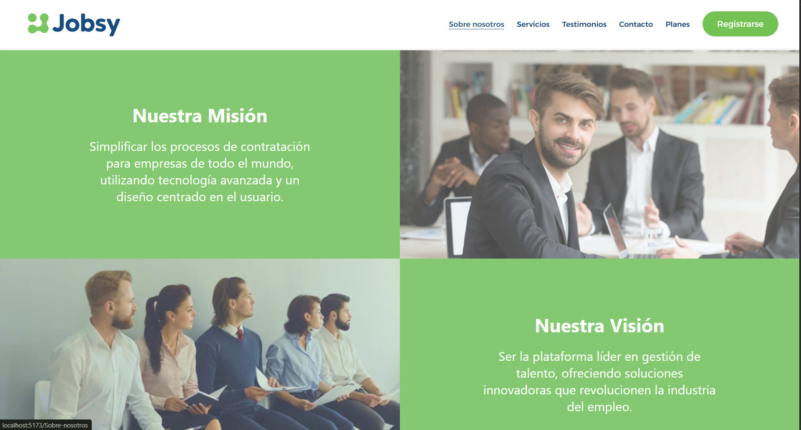

# Universidad Peruana De Ciencias Aplicadas

## Ingeniería de Software

### Informe de Trabajo Final

### Aplicaciones Web

**Sección:** 
4364

**Profesor:**  

Sánchez Ponce, Alex Humberto

**Integrantes:**

    <ul>
        <li>Peralta Chipa Ronald Joel - U202224619</li>
        <li>Bustamante Leveau Cameron Charlotte - U20231A804</li>
        <li>Lapa de la Cruz Gabriel Omar - U202216831</li>
        <li>Urrutia Peña Jasmin Adriana - U202310008</li>
        <li>otro companiero</li>
    </ul>

**2025 - 01**

---

# **Registro de Versiones del Informe**

| Versión | Fecha      | Autor                          | Descripción de modificación      |
|---------|------------|--------------------------------|----------------------------------|
| TB1     | 26/01/2025 | Ronald Joel Peralta Chipa      | (Descripción de los cambios)     |
| TB2     |            |                                |                                  |
| TB3     |            |                                |                                  |

# **Project Report Collaboration Insights**

# **Contenido**

### Tabla de contenidos

- [**Registro de Versiones del Informe**](#registro-de-versiones-del-informe)
- [**Project Report Collaboration Insights**](#project-report-collaboration-insights)
- [**Contenido**](#contenido)
  - [Tabla de contenidos](#tabla-de-contenidos)
- [**Student Outcome**](#student-outcome)
- [ **Capítulo I: Introducción** ](#-capítulo-i-introducción-)
  - [**1.1. Startup Profile**](#11-startup-profile)
    - [**1.1.1. Descripción de la Startup**](#111-descripción-de-la-startup)
    - [**1.1.2. Perfiles de integrantes del equipo**](#112-perfiles-de-integrantes-del-equipo)
  - [**1.2. Solution Profile**](#12-solution-profile)
    - [**1.2.1 Antecedentes y problemática**](#121-antecedentes-y-problemática)
    - [What (¿Qué?)](#what-qué)
    - [Who (¿Quién?)](#who-quién)
    - [Where (¿Dónde?)](#where-dónde)
    - [When (¿Cuándo?)](#when-cuándo)
    - [Why (¿Por qué?)](#why-por-qué)
    - [How (¿Cómo?)](#how-cómo)
    - [How much (¿Cuánto?)](#how-much-cuánto)
    - [**1.2.2 Lean UX Process**](#122-lean-ux-process)
    - [**1.2.2.1. Lean UX Problem Statements**](#1221-lean-ux-problem-statements)
    - [**1.2.2.2. Lean UX Assumptions**](#1222-lean-ux-assumptions)
    - [**1.2.2.3. Lean UX Hypothesis Statements**](#1223-lean-ux-hypothesis-statements)
    - [**1.2.2.4. Lean UX Canvas**](#1224-lean-ux-canvas)
  - [**1.3. Segmentos objetivo**](#13-segmentos-objetivo)
- [ **Capítulo II: Requirements Elicitation \& Analysis**](#-capítulo-ii-requirements-elicitation--analysis)
  - [**2.1. Competidores**](#21-competidores)
    - [**2.1.1. Análisis competitivo**](#211-análisis-competitivo)
    - [**2.1.2. Estrategias y tácticas frente a competidores**](#212-estrategias-y-tácticas-frente-a-competidores)
  - [**2.2. Entrevistas**](#22-entrevistas)
    - [**2.2.1. Diseño de entrevistas**](#221-diseño-de-entrevistas)
    - [**2.2.2. Registro de entrevistas**](#222-registro-de-entrevistas)
    - [**2.2.3. Análisis de entrevistas**](#223-análisis-de-entrevistas)
  - [**2.3. Needfinding**](#23-needfinding)
    - [**2.3.1. User Personas**](#231-user-personas)
    - [**2.3.2. User Task Matrix**](#232-user-task-matrix)
    - [**2.3.3. User Journey Mapping**](#233-user-journey-mapping)
    - [**2.3.4. Empathy Mapping**](#234-empathy-mapping)
    - [**2.3.5. As-is Scenario Mapping**](#235-as-is-scenario-mapping)
  - [**2.4. Ubiquitous Language**](#24-ubiquitous-language)
- [ **Capítulo III: Requirements Specification**](#-capítulo-iii-requirements-specification)
  - [**3.1. To-Be Scenario Mapping**](#31-to-be-scenario-mapping)
  - [**3.2. User Stories**](#32-user-stories)
  - [**3.3. Impact Mapping**](#33-impact-mapping)
  - [**3.4. Product Backlog**](#34-product-backlog)
- [**Capítulo IV: Product Design**](#capítulo-iv-product-design)
  - [**4.1. Style Guidelines**](#41-style-guidelines)
    - [**4.1.1. General Style Guidelines**](#411-general-style-guidelines)
    - [**4.1.2. Web Style Guidelines**](#412-web-style-guidelines)
  - [**4.2. Information Architecture**](#42-information-architecture)
    - [**4.2.1. Organization Systems**](#421-organization-systems)
    - [**4.2.2. Labeling Systems**](#422-labeling-systems)
    - [**4.2.3. SEO Tags and Meta Tags**](#423-seo-tags-and-meta-tags)
    - [**4.2.4. Searching Systems**](#424-searching-systems)
    - [**4.2.5. Navigation Systems**](#425-navigation-systems)
  - [**4.3. Landing Page UI Design**](#43-landing-page-ui-design)
    - [**4.3.1. Landing Page Wireframe**](#431-landing-page-wireframe)
    - [**4.3.2. Landing Page Mock-up**](#432-landing-page-mock-up)
  - [**4.4. Web Applications UX/UI Design**](#44-web-applications-uxui-design)
    - [**4.4.1. Web Applications Wireframes**](#441-web-applications-wireframes)
    - [**4.4.2. Web Applications Wireflow Diagrams**](#442-web-applications-wireflow-diagrams)
    - [**4.4.3. Web Applications Mock-ups**](#443-web-applications-mock-ups)
    - [**4.4.4. Web Applications User Flow Diagrams**](#444-web-applications-user-flow-diagrams)
  - [**4.5. Web Applications Prototyping**](#45-web-applications-prototyping)
  - [**4.6. Domain-Driven Software Architecture**](#46-domain-driven-software-architecture)
    - [**4.6.1. Software Architecture Context Diagram**](#461-software-architecture-context-diagram)
    - [**4.6.2. Software Architecture Container Diagrams**](#462-software-architecture-container-diagrams)
    - [**4.6.3. Software Architecture Components Diagrams**](#463-software-architecture-components-diagrams)
  - [**4.7. Software Object-Oriented Design**](#47-software-object-oriented-design)
    - [**4.7.1. Class Diagrams**](#471-class-diagrams)
    - [**4.7.2. Class Dictionary**](#472-class-dictionary)
  - [**4.8. Database Design**](#48-database-design)
    - [**4.8.1. Database Diagram**](#481-database-diagram)
- [**Capítulo V: Product Implementation, Validation & Deployment**](#capítulo-v-product-implementation-validation--deployment)
  - [**5.1. Software Configuration Management**](#51-software-configuration-management)
    - [**5.1.1. Software Development Environment Configuration**](#511-software-development-environment-configuration)
    - [**5.1.2. Source Code Management**](#512-source-code-management)
    - [**5.1.3. Source Code Style Guide & Conventions**](#513-source-code-style-guide--conventions)
    - [**5.1.4. Software Deployment Configuration**](#514-software-deployment-configuration)
  - [**5.2. Landing Page, Services & Applications Implementation**](#52-landing-page-services--applications-implementation)
    - [**5.2.1. Sprint 1**](#521-sprint-1)
      - [**5.2.1.1. Sprint Planning 1**](#5211-sprint-planning-1)
      - [**5.2.1.2. Aspect Leaders and Collaborators**](#5212-aspect-leaders-and-collaborators)
      - [**5.2.1.3. Sprint Backlog 1**](#5213-sprint-backlog-1)
      - [**5.2.1.4. Development Evidence for Sprint Review**](#5214-development-evidence-for-sprint-review)
      - [**5.2.1.5. Execution Evidence for Sprint Review**](#5215-execution-evidence-for-sprint-review)
      - [**5.2.1.6. Services Documentation Evidence for Sprint Review**](#5216-services-documentation-evidence-for-sprint-review)
      - [**5.2.1.7. Software Deployment Evidence for Sprint Review**](#5217-software-deployment-evidence-for-sprint-review)
      - [**5.2.1.8. Team Collaboration Insights during Sprint**](#5218-team-collaboration-insights-during-sprint)
    - [**5.2.2. Sprint 2**](#522-sprint-2)
      - [**5.2.2.1. Sprint Planning 2**](#5221-sprint-planning-2)
      - [**5.2.2.2. Aspect Leaders and Collaborators**](#5222-aspect-leaders-and-collaborators)
      - [**5.2.2.3. Sprint Backlog 2**](#5223-sprint-backlog-2)
      - [**5.2.2.4. Development Evidence for Sprint Review**](#5224-development-evidence-for-sprint-review)
      - [**5.2.2.5. Execution Evidence for Sprint Review**](#5225-execution-evidence-for-sprint-review)
      - [**5.2.2.6. Services Documentation Evidence for Sprint Review**](#5226-services-documentation-evidence-for-sprint-review)
      - [**5.2.2.7. Software Deployment Evidence for Sprint Review**](#5227-software-deployment-evidence-for-sprint-review)
      - [**5.2.2.8. Team Collaboration Insights during Sprint**](#5228-team-collaboration-insights-during-sprint)
    - [**5.2.3. Sprint 3**](#523-sprint-3)
      - [**5.2.3.1. Sprint Planning 3**](#5231-sprint-planning-3)
      - [**5.2.3.2. Aspect Leaders and Collaborators**](#5232-sprint-planning-3)
      - [**5.2.3.3. Sprint Backlog 3**](#5233-sprint-backlog-3)
      - [**5.2.3.4. Development Evidence for Sprint Review**](#5234-development-evidence-for-sprint-review)
      - [**5.2.3.5. Execution Evidence for Sprint Review**](#5235-execution-evidence-for-sprint-review)
      - [**5.2.3.6. Services Documentation Evidence for Sprint Review**](#5236-services-documentation-evidence-for-sprint-review)
      - [**5.2.3.7. Software Deployment Evidence for Sprint Review**](#5237-software-deployment-evidence-for-sprint-review)
      - [**5.2.3.8. Team Collaboration Insights during Sprint**](#5238-team-collaboration-insights-during-sprint)
  - [**5.3. Validation Interviews**](#53-validation-interviews)
    - [**5.3.1. Diseño de Entrevistas**](#531-diseño-de-entrevistas)
    - [**5.3.2. Registro de Entrevistas**](#532-registro-de-entrevistas)
    - [**5.3.3. Evaluaciones según heurísticas**](#533-evaluaciones-según-heurísticas)

# **Student Outcome**

#  **Capítulo I: Introducción** 

## **1.1. Startup Profile**
### **1.1.1. Descripción de la Startup**
### **1.1.2. Perfiles de integrantes del equipo**

## **1.2. Solution Profile**
### **1.2.1. Antecedentes y problemática**
### **What (¿Qué?)**
### **Who (¿Quién?)**
### **Where (¿Dónde?)**
### **When (¿Cuándo?)**
### **Why (¿Por qué?)**
### **How (¿Cómo?)**
### **How much (¿Cuánto?)**

### **1.2.2. Lean UX Process**
#### **1.2.2.1. Lean UX Problem Statements**
#### **1.2.2.2. Lean UX Assumptions**
#### **1.2.2.3. Lean UX Hypothesis Statements**
#### **1.2.2.4. Lean UX Canvas**

## **1.3. Segmentos objetivo**

#  **Capítulo II: Requirements Elicitation & Analysis**

## **2.1. Competidores**
### **2.1.1. Análisis competitivo**
### **2.1.2. Estrategias y tácticas frente a competidores**

## **2.2. Entrevistas**
### **2.2.1. Diseño de entrevistas**
### **2.2.2. Registro de entrevistas**
### **2.2.3. Análisis de entrevistas**

## **2.3. Needfinding**
### **2.3.1. User Personas**
### **2.3.2. User Task Matrix**
### **2.3.3. User Journey Mapping**
### **2.3.4. Empathy Mapping**
### **2.3.5. As-is Scenario Mapping**

## **2.4. Ubiquitous Language**

#  **Capítulo III: Requirements Specification**

## **3.1. To-Be Scenario Mapping**
## **3.2. User Stories**
## **3.3. Impact Mapping**
## **3.4. Product Backlog**
# **Capítulo IV: Product Design**
## **4.1. Style Guidelines**
### 4.1.1. General Style Guidelines
### 4.1.2. Web Style Guidelines

## **4.2. Information Architecture**
### **4.2.1. Organization Systems**
#### **Segmento 1: Equipos de Recursos Humanos encargados del proceso de contratación.**
#### **Segmento 2: Postulantes o Candidatos**
### **4.2.2. Labeling Systems**
### **4.2.3. SEO Tags and Meta Tags**
### **4.2.4. Searching Systems**
### **4.2.5. Navigation Systems**
## **4.3. Landing Page UI Design**
### **4.3.1. Landing Page Wireframe**
### **4.3.2. Landing Page Mock-up**
## **4.4. Web Applications UX/UI Design**
### **4.4.1. Web Applications Wireframes**
### **4.4.2. Web Applications Wireflow Diagrams**
### **4.4.3. Web Applications Mock-ups**
### **4.4.4. Web Applications User Flow Diagrams**

## **4.5. Web Applications Prototyping**
## **4.6. Domain-Driven Software Architecture**
### **4.6.1. Software Architecture Context Diagram**
### **4.6.2. Software Architecture Container Diagrams**
### **4.6.3. Software Architecture Components Diagrams**
## **4.7. Software Object-Oriented Design**
### **4.7.1. Class Diagrams**
### **4.7.2. Class Dictionary**
## **4.8. Database Design**
### **4.8.1. Database Diagram**
# **Capítulo V: Product Implementation, Validation & Deployment**
## **5.1. Software Configuration Management**

A continuación, se presentan las decisiones y convenciones que permitirán mantener la consistencia durante el ciclo de vida.

### **5.1.1. Software Development Environment Configuration**

En esta sección se incluyen los links de las aplicaciones y productos de software utilizados durante el ciclo del proyecto Jobsy, en los programas que se usaron para colaborar en el desarrollo del producto digital.
Para ello se clasifican en las siguientes secciones:

### **5.1.2. Source Code Management**
1. **Project Management**  
Es la disciplina encargada de la gestión de los proyectos, la cual tiene como objetivo principal mejorar los procesos y su entorno para alcanzar los resultados esperados.  
- En el ciclo digital del proyecto se implementará un producto software con un modelo SaaS que se ejecutará a través de un navegador, sin embargo, no se creará una versión de aplicación móvil.

---

2. **Requirements Management**  
Es el proceso de garantizar que una organización documente, verifique y satisfaga las necesidades y expectativas de sus clientes con las partes interesadas internas o externas.  
- **Pivotal Tracker**: Se usó esta herramienta porque organiza bien las user stories y ayuda a mantener el avance del proyecto claro y ordenado.

Link: [https://www.pivotaltracker.com/](https://www.pivotaltracker.com/)

---

3. **Product UX/UI Design**  
Estas herramientas permiten desarrollar el modelo de nuestro producto de manera digital y de forma parte de la vida del consumidor. En este caso se realizó un modelo de sitio web.  
- **Uxpressia**: Usamos esta herramienta para elaborar los User Persona, Empathy Maps, Journey Maps e Impact Maps.  
Link: [https://uxpressia.com/](https://uxpressia.com/)

- **Miro**: Se usó esta herramienta para los As-Is y To-Be Scenario Maps.  
Link: [https://miro.com/](https://miro.com/)

- **Figma**: Se usó esta herramienta para la elaboración de Wireframes, Mock-ups y Prototypes de nuestra Landing Page y nuestra Web Application.  
Link: [https://www.figma.com/](https://www.figma.com/)

- **Lucidchart**: Se usó esta herramienta para la elaboración de Wireflows y User Flows.  
Link: [https://www.lucidchart.com/](https://www.lucidchart.com/)

4. **Software Development**  
- **GitHub**: Es la plataforma utilizada para el control de versiones, colaboración entre los integrantes del equipo y almacenamiento del código fuente del proyecto. A través de GitHub se aplicó GitFlow para mantener un flujo de trabajo ordenado y estructurado.  
Link: [https://github.com/](https://github.com/)

- **HTML**: Se utilizó para estructurar el contenido de la Landing Page y de las vistas principales de la aplicación web, permitiendo una organización semántica del contenido.  
Link: [https://developer.mozilla.org/es/docs/Web/HTML](https://developer.mozilla.org/es/docs/Web/HTML)

- **CSS**: Fue empleado para definir el diseño visual del sitio, respetando la línea estética basada en Material Design. Se aplicaron estilos personalizados para lograr una interfaz moderna y agradable al usuario.  
Link: [https://developer.mozilla.org/es/docs/Web/CSS](https://developer.mozilla.org/es/docs/Web/CSS)

- **JavaScript**: El lenguaje de programación utilizado para implementar la lógica del lado del cliente, como validaciones, interacciones dinámicas y consumo de servicios externos.  
Link: [https://developer.mozilla.org/es/docs/Web/JavaScript](https://developer.mozilla.org/es/docs/Web/JavaScript)

---

5. **Software Testing**  
- **Lenguaje Gherkins**: Se utilizó Gherkins para definir los criterios de aceptación y los escenarios de prueba en un lenguaje natural, facilitando la comprensión tanto para desarrolladores como para usuarios no técnicos.  
Link para más información: [https://profile.es/blog/que-es-gherkin/](https://profile.es/blog/que-es-gherkin/)

---

6. **Software Documentation**  
- **LucidChart**: Se usó esta herramienta para la elaboración de diagramas UML y Diagramas de Base de Datos.  
Link: [https://www.lucidchart.com/](https://www.lucidchart.com/)

- **Structurizr**: Se usó Structurizr bajo el modelo C4 para documentar la arquitectura del software, dividiendo la estructura en diferentes niveles de detalle (Context, Container, Component y Code).  
Link: [https://structurizr.com/](https://structurizr.com/)

### **5.1.3. Source Code Style Guide & Conventions**
Se adoptaron guías de estilo estándar en inglés para cada lenguaje empleado:

- **HTML/CSS**: Google HTML/CSS Style Guide
- **JavaScript**: Google JavaScript Style Guide, MDN Guidelines

Esto asegura legibilidad, coherencia y facilidad de mantenimiento en todo el código del proyecto.

### **5.1.4. Software Deployment Configuration**
La gestión del código fuente del proyecto Jobsy se realizó utilizando GitHub. Para la publicación y despliegue de la Landing Page, se empleó **GitHub Pages**, que permite una visualización directa desde el repositorio principal.

Para el desarrollo y despliegue de la Landing Page de Jobsy se han utilizado las siguientes herramientas:

- **HTML**: Lenguaje de marcado que permitió estructurar el contenido visual y semántico de la Landing Page. Se utilizó para crear elementos como encabezados, párrafos, botones, formularios, entre otros.

- **CSS**: Lenguaje de estilos utilizado para dar formato, color, distribución y diseño gráfico a los elementos definidos en HTML. Gracias a CSS, se logró que la Landing Page sea más visualmente atractiva e interactiva.

- **JavaScript**: Utilizado para añadir interactividad y dinamismo a los componentes de la Landing Page, como validaciones en formularios, navegación fluida y respuestas a eventos del usuario.

Link para la visualización de la Landing Page: 

## **5.2. Landing Page, Services & Applications Implementation**
### **5.2.1. Sprint 1**
#### **5.2.1.1. Sprint Planning 1**

| **Sprint #**                    | Sprint 1 |
|----------------------------------|----------|
| **Sprint Planning Background**  |          |
| **Date**                        | 11/04/2025 |
| **Time**                        | 8:00 pm |
| **Location**                    | Virtual (Discord) |
| **Prepared by**                 | Peralta Chipa Ronald Joel |
| **Attendees (to planning meeting)** | Peralta Chipa Ronald Joel   Bustamante Leveau Cameron Charllotte   Urrutia Peña Jasmin Adriana   Mauro Fabricio Lopez de la Cruz   Lapa de la Cruz Gabriel Omar |
| **Sprint n - 1 Review Summary**  | No hubo sprint anterior |
| **Sprint n - 1 Retrospective Summary** | No hubo sprint anterior |
| **Sprint Goal & User Stories**   |          |
| **Sprint 1 Goal**                | Realizar el Landing Page / Informe de trabajo |
| **Sprint 1 Velocity**            | 10 |
| **Sum of Story Points**          | 8 |

#### **5.2.1.2. Aspect Leaders and Collaborators**

| Team Member (Last Name, First Name) | GitHub Username | Implementar Home (L/C) | Implementar Contacto (L/C) | Implementar Planes (L/C) | Implementar Servicios (L/C) | Implementar Sobre Nosotros (L/C) | Implementar Testimonio (L/C) |
|:-----------------------------------|:----------------|:-----------------------|:---------------------------|:--------------------------|:----------------------------|:-------------------------------|:----------------------------|
| Peralta, Ronald                    | Ronni-FSTK       | L                       | L                           | C                          | C                            | C                               | C                            |
| Bustamante, Cameron                | CameronBustamanteLeveau2 | C              | C                           | L                          | C                            | C                               | C                            |
| Urrutia, Jazmin                    | SrtaYeis         | C                       | C                           | C                          | L                            | C                               | C                            |
| Lopez, Mauro                       | FabricioLop      | C                       | C                           | C                          | C                            | L                               | C                            |
| Lapa, Gabriel                      | Gabo0722         | C                       | C                           | C                          | C                            | C                               | L                            |

#### **5.2.1.3. Sprint Backlog 1**

| Sprint # | Sprint |          |           |             |         |         |        |
|----------|--------|----------|-----------|-------------|---------|---------|--------|
| **User Story** | | **Work Item / Task** | | | | | |
| ID | Title | ID | Title | Description | Estim. Hours | Assigned | Status |
| --- | --- | --- | --- | --- | --- | --- | --- |
| US010 | Registrar cuenta postulante | T1 | Implementar Home | Desarrollar la página principal que dará acceso a las funcionalidades. | 2hrs | Ronald | Done |
|      |                                  | T2 | Implementar Contacto | Construir un formulario de contacto para que los usuarios puedan registrarse. | 3hrs | Ronald | Done |
| US022 | Registrar método de pago | T3 | Implementar planes | Diseñar la sección que presenta los diferentes planes disponibles. | 3hrs | Jazmín | Done |
|      |                                  | T4 | Implementar servicios | Integrar un apartado donde se detalle cada servicio ofrecido. | 3hrs | Fabricio | Done |
| US025 | Configurar notificaciones | T5 | Implementar Sobre nosotros | Elaborar un apartado que describa la misión y visión de la página. | 2hrs | Gabriel | Done |
|      |                                  | T6 | Implementar testimonio | Incorporar un espacio para mostrar opiniones y experiencias de clientes. | 2hrs | Cameron | Done |

#### **5.2.1.4. Development Evidence for Sprint Review**
Se realizaron los avances con los commits correspondiente en el repositorio de la siguiente forma.

- Repositorio Landing Page:

| Repository | Branch | Commit Id | Commit Message | Committed on (Date) |
|:----------:|:------:|:---------:|:--------------:|:------------------:|
| Landing-Page | feat/home | 8ab70ee9b0430fa5eb1a21d8d4bbc7fab5a99691 | Update Page/Home | 25/04/2025 |
| Landing-Page | feat/servicios | be91f5210ca4b98d7a5ff1621e2d997b1f70cfdb | fix:update ContentService | 26/04/2025 |
| Landing-Page | feat/sobrenosotros | 9c53463046f305aeac086e92fd213e56a7a85ae6 | feat: add Sobre Nosotros in Landing Page | 26/04/2025 |
| Landing-Page | feat/planes | 57499e38aa7636347e10a5c363e686511870da07 | feat: add membresia | 26/04/2025 |
| Landing-Page | feat/planes | 4124f766cc3a6ecf990bb1d163a89c5e01356718 | feat(landing): agregar sección Planes/Enterprise | 26/04/2025 |
| Landing-Page | feat/planes | e1b84cfb86447812eb9a81d3b568d024d1dfa7ec | feat: Create Plan Standard | 26/04/2025 |
| Landing-Page | feat/testimonios | 3dfcbffb7b7d377b6de846296e24eec2102dc6d8 | feat: update Testimonios in Landing Page | 26/04/2025 |
| Landing-Page | feat/contactos | aca53d1877cb522454cac9f079b7fdb9a1e4a0b2 | the contacts section completed | 25/04/2025 |

#### **5.2.1.5. Execution Evidence for Sprint Review**
Al concluir el primer sprint, se logró implementar todas las secciones planificadas en la landing page, garantizando una visualización óptima y atractiva para los usuarios. Se diseñó una interfaz llamativa, respetando las heurísticas de usabilidad y las mejores prácticas de desarrollo UI.

Se incorporaron botones dinámicos, efectos de transición entre páginas y una barra de navegación intuitiva, todo con el propósito de ofrecer una experiencia fluida y envolvente. La landing page cumple una función clave: captar y retener a los visitantes, transformándolos en potenciales clientes interesados en nuestros servicios.

**A continuación, se presentan capturas de pantalla que ilustran los avances y detalles de la interfaz.**

Barra de navegacion con secciones como "Sobre Nosotros" "Servicios" "Testimonios" "Contactos" "Planes". Tambien se obersva el "Logo Home" y un boton de registro. Toda la barra navegación tiene una anmicacion de sub rayado para saber en que seccion estamos.

En el home podemos observar el logo de la plataforma y un botón para el registro de usuarios nuevos. Exíste una animacion para tener una mejor experiencia al entrar al la pagina principal (home)

También se presenta la sección "Sombre nostros", un elemento clave para fortalecer nuestra credibilidad como empresa. Esta sección proporciona información detallada sobre nuestra misión y visión, permitiendo a los usuarios conocer quiénes somos y qué nos distingue en el mercado. Con ello, buscamos generar confianza y afianzar nuestra relación con potenciales clientes

En esta sección se destacan los servicios que ofrecemos como empresa, asegurando que nuestros visitantes tengan siempre una visión clara de nuestro enfoque y especialización. Presentamos de manera estructurada nuestras soluciones, permitiendo a los usuarios comprender cómo podemos atender sus necesidades y aportar valor. Esto refuerza nuestra identidad y facilita la conexión con el público objetivo.

En la sección de testimonios, los usuarios que han probado nuestro sistema comparten sus experiencias y opiniones sobre su funcionamiento. A través de sus comentarios, resaltan los beneficios y ventajas que han encontrado, reforzando la confianza en nuestra solución y demostrando su valor. Estos testimonios sirven como una referencia clave para futuros clientes, brindándoles una visión real y auténtica del impacto positivo de nuestro sistema. 

La sección "Contáctanos" es fundamental dentro de nuestra landing page, ya que actúa como el puente directo entre nuestros usuarios y nosotros. A través de esta sección, los visitantes pueden solicitar información adicional o acceder a una atención más personalizada según sus necesidades. Su diseño claro e intuitivo facilita la comunicación, fortaleciendo la relación con potenciales clientes y permitiendo que la interacción sea rápida y efectiva.

En esta sección se presentan los dos planes disponibles: el Plan Gratis y el Plan Pro. Cada uno está diseñado para adaptarse a diferentes necesidades y niveles de servicio.

#### **5.2.1.6. Services Documentation Evidence for Sprint Review**
Este punto, refiere a una sección donde se documenta evidencias sobre los servicios desarrollados durante el Sprint 1. 

<table border="1">
  <thead>
    <tr>
      <th>EndPoint</th>
      <th>Funciones</th>
    </tr>
  </thead>
  <tbody>
    <tr>
      <td>
          https://github.com/Aplicaciones-WEB-Report/Landing-Page-
      </td>
      <td>Se desplegó exitosamente la landing page de Jobsy en GitHub Pages, con navegación funcional entre secciones como Inicio, Acerca de, Servicios y Contacto.</td>
    </tr>

  </tbody>
</table>

#### **5.2.1.7. Software Deployment Evidence for Sprint Review**
En este Sprint, se realizó el despliegue inicial de la landing page del proyecto Jobsy, marcando el comienzo del proceso de publicación gradual de los componentes del sistema. Esta acción tuvo como propósito principal validar visualmente los avances en diseño e interacción, tanto con el cliente como con el equipo docente.
- URL de la landing page desplegada:

#### **5.2.1.8. Team Collaboration Insights during Sprint.**
Para esta entrega, nuestro objetivo fue implementar y desplegar la Landing Page utilizando herramientas como GitHub, Visual Studio Code, HTML, Tailwind-CSS y React-JavaScript. En las siguientes secciones, presentaremos los diagramas de flujo de los commits realizados por cada miembro del equipo DigitAholics, detallando el proceso de desarrollo y colaboración.

### **5.2.2. Sprint 2**
#### **5.2.2.1. Sprint Planning 2**
| **Sprint #**                    | Sprint 2 |
|--------------------------------|----------|
| **Sprint Planning Background** |          |
| **Date**                       | 09/05/2025 |
| **Time**                       | 10:00 pm |
| **Location**                   | Virtual (Discord) |
| **Prepared by**                | Peralta Chipa Ronald Joel |
| **Attendees (to planning meeting)** | Peralta Chipa Ronald Joel   Bustamante Leveau Cameron Charllotte   Urrutia Peña Jasmin Adriana   Mauro Fabricio Lopez de la Cruz   Lapa de la Cruz Gabriel Omar |
| **Sprint n - 1 Review Summary** | Implementación de la Landing Page de Jobsy |
| **Sprint n - 1 Retrospective Summary** | Hubo coordinación constante del equipo, lo que permitió cumplir con los requisitos previamente planteados. |
| **Sprint Goal & User Stories** | Implementar funcionalidades del Frontend y completar el informe correspondiente |
| **Sprint 2 Velocity**          | 20 |
| **Sum of Story Points**        | 15 |

#### **5.2.2.2. Aspect Leaders and Collaborators**
| Team Member (Last Name, First Name) | GitHub Username | Implementar IA (L/C) | Implementar Postulaciones (L/C) | Implementar Analíticas (L/C) | Implementar Perfiles (L/C) | Implementar Publicaciones (L/C) | Implementar Candidatos (L/C) |
|------------------------------------|-----------------|----------------------|-------------------------------|------------------------------|-----------------------------|-------------------------------|------------------------------|
| Peralta, Ronald                    | Ronni-FSTK      | L                    | L                             | C                            | C                           | C                             | C                            |
| Bustamante, Cameron               | CameronBustamanteLeveau2 | C        | C                             | L                            | C                           | C                             | C                            |
| Urrutia, Jazmin                   | SrtaYeis        | C                    | C                             | C                            | L                           | C                             | C                            |
| Lopez, Mauro                      | FabricioLop     | C                    | C                             | C                            | C                           | L                             | C                            |
| Lapa, Gabriel                     | Gabo0722        | C                    | C                             | C                            | C                           | C                             | L                            |

#### **5.2.2.3. Sprint Backlog 2**
| **User Story** | **Work Item / Task** | ID  | Title | Description | Estim. Hours | Assigned | Status |
|----------------|----------------------|-----|--------|-------------|---------------|----------|--------|
| US013 | Sugerencia de candidatos | T1  | Implementar botón que agregue candidatos | Desarrollar el botón donde aparecerá más candidatos para ver su descripción. | 4hrs | Gabriel | Done |
|        |                              | T2  | Implementar botón Ver más para editar estado | Desarrollar funcionalidad para cambiar el estado del candidato desde una ventana modal. | 3hrs | Gabriel | Done |
| US012 | Editar perfil profesional     | T4  | Implementar perfil del usuario | Integrar el apartado de perfiles de usuarios. | 3hrs | Jazmín | Done |
|        |                              | T5  | Implementar perfil de administrador | Integrar el apartado de perfiles de administrador. | 2hrs | Jazmín | Done |
| US009 | Enviar oferta laboral         | T6  | Implementar publicaciones | Consultar y mostrar publicaciones de candidatos. | 3hrs | Fabricio | Done |
|        |                              | T7  | Implementar analíticas | Mostrar gráficos de métricas sobre publicaciones y perfiles. | 3hrs | Cameron | Done |
| US005 | Ver postulaciones recibidas  | T8  | Implementar postulaciones | Elaborar componente de postulaciones según consulta de candidatos. | 3hrs | Ronald | In Process |

#### **5.2.2.4. Development Evidence for Sprint Review**
Se realizaron los avances con los commits correspondientes en el repositorio:

- Repositorio Front-End:

| Repository     | Branch              | Commit Id | Commit Message                                      | Committed on (Date) |
|----------------|---------------------|-----------|-----------------------------------------------------|----------------------|
| frontend-app   | feat/bandejaEntrada | d31633738030fad71a6fbbb7e2c50eeb09cf0302 | Update PrincipalReclutador.vue                       | 14/05/2025 |
| frontend-app   | feat/postulaciones  | a6794af5a99e8ce2762f9bc34dbeb3234dbe24dc | add publicacion                                      | 14/05/2025 |
| frontend-app   | feat/analíticas     | 33a825adb4ac1677ddf181121d020bb86a2e061b | docs(analiticas): add analiticas y panel principal   | 13/05/2025 |
| frontend-app   | feat/candidatos     | a363b57ad85422a4453fc38f92e74ae44c5f86cc | feat: update Candidatos.vue in pages                 | 14/05/2025 |
| frontend-app   | feat/publications   | 19a875dac03545d2c7345d3d0e2dde189994860c | AI aggregation                                       | 13/05/2025 |
| frontend-app   | feat/perfil         | 9db7ae958e3705d2ed7d628aaff4aad526744623 | feat: add Perfil Postulante y Reclutador             | 14/05/2025 |

#### **5.2.2.5. Execution Evidence for Sprint Review**
#### **5.2.2.6. Services Documentation Evidence for Sprint Review**
#### **5.2.2.7. Software Deployment Evidence for Sprint Review**
#### **5.2.2.8. Team Collaboration Insights during Sprint**

### **5.2.1. Sprint 3**
#### **5.2.3.1. Sprint Planning 3**

| **Sprint #**                    | Sprint 3 |
|----------------------------------|----------|
| **Sprint Planning Background**  |          |
| **Date**                        | 11/05/2025 |
| **Time**                        | 10:00 pm |
| **Location**                    | Virtual (Discord) |
| **Prepared by**                 | Peralta Chipa Ronald Joel |
| **Attendees (to planning meeting)** | Peralta Chipa Ronald Joel   Bustamante Leveau Cameron Charllotte   Urrutia Peña Jasmin Adriana   Mauro Fabricio Lopez de la Cruz   Lapa de la Cruz Gabriel Omar |
| **Sprint 2 Review Summary**  | Implementación del Frontend de Jobsy |
| **Sprint 2 Retrospective Summary** | El equipo mantuvo una coordinación continua, lo cual facilitó el cumplimiento de los objetivos establecidos durante el Sprint 2 |
| **Sprint Goal & User Stories**   |          |
| **Sprint 3 Goal**                | Realizar el Backend / Informe de trabajo |
| **Sprint 3 Velocity**            | 20 |
| **Sum of Story Points**          | 15 |

#### **5.2.3.2. Aspect Leaders and Collaborators**
#### **5.2.3.3. Sprint Backlog 3**
#### **5.2.3.4. Development Evidence for Sprint Review**
#### **5.2.3.5. Execution Evidence for Sprint Review**
#### **5.2.3.6. Services Documentation Evidence for Sprint Review**
#### **5.2.3.7. Software Deployment Evidence for Sprint Review**
#### **5.2.3.8. Team Collaboration Insights during Sprint**

## **5.3. Validation Interviews**
### **5.3.1. Diseño de Entrevistas**
### **5.3.2. Registro de Entrevistas**
### **5.3.3. Evaluaciones según heurísticas**
